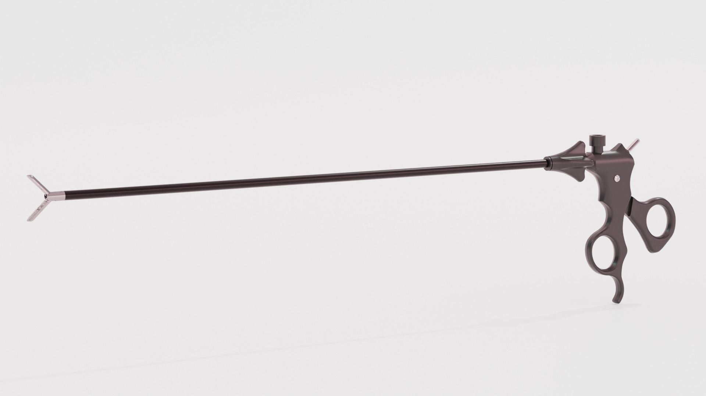
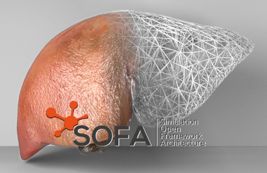

# Mixed Reality (MR) Surgical Training App for Meta Quest

This is a Unity-based mixed reality application for surgical training. This project demonstrates advanced articulated tool manipulation, trigger-based physics, and smooth animation systems specifically designed for Meta Quest devices in medical training scenarios.

## 🎯 Project Overview

### Key Features

### Laparoscopic Forceps

The laparoscopic forceps module represents one of core functionalities of this training application.

### Organs Interaction

Integrates the Simulation Open Framework Architecture (SOFA) via the SofaUnity bridge to provide real-time, deformable organ models and instrument-to-tissue interactions for surgical training scenarios.

## 📋 Requirements
### Development Environment
- **Unity Hub:** 3.12.1
- **Unity Editor:** 2022.3 LTS

### Packages
-	AR Foundation (4.2.7+)
-	Meta XR SDK (57.0+)
-	XR Interaction Toolkit (2.6.4+)
-	XR Plugin Management (4.4.0+)
-	Oculus XR Plugin (3.2.3+)
-	Obi Rope (7.1+)
-   SofaUnity (24.12.00)

### Platform Support
- **Meta Quest 2**
- **Meta Quest 3**
- **Meta Quest Pro**

## 🛠️ Installation
--

## 📄 License

This project is licensed under the MIT License - see the [LICENSE](LICENSE) file for details.
